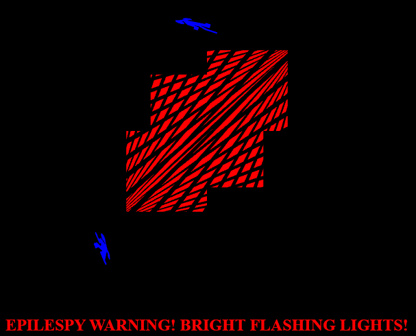

# WebGL - Lab2: 2D Transformaions
Elijah Morgan\
CIS 367 01

### Development Info
| OS      | Browser       |
|---------|---------------|
| Ubuntu  | Chrome        |

### Completed Tasks

### Incomplete Tasks

Your program will show a 2D scene similar to the example at https://harviu.github.io/WebGL-Example/html/soldier.html
* Your scene should contain at least 3 layers of hierarchy. (3 points)
* Each hierarchy should contain at least one transformation. (3 points)
* Each of Translation, Scaling, and Rotation should be correctly implemented and used at least once. (1 point)
* Transformations are bound to user input and interaction. (1 point)
* Creativity and aesthetics. (1 point)